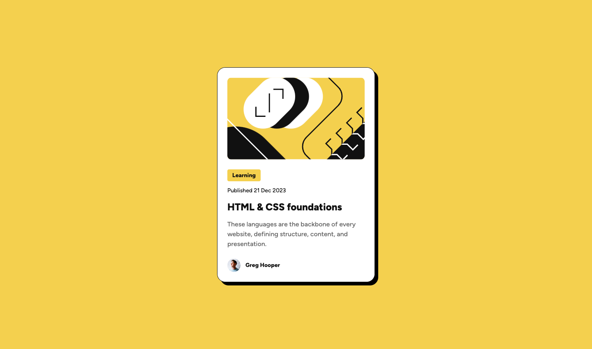

# Frontend Mentor - Blog preview card solution

This is a solution to the [Blog preview card challenge on Frontend Mentor](https://www.frontendmentor.io/challenges/blog-preview-card-ckPaj01IcS). Frontend Mentor challenges help you improve your coding skills by building realistic projects. 

## Table of contents

- [Overview](#overview)
  - [The challenge](#the-challenge)
  - [Screenshot](#screenshot)
  - [Links](#links)
- [My process](#my-process)
  - [Built with](#built-with)
  - [What I learned](#what-i-learned)
  - [Continued development](#continued-development)
  - [Useful resources](#useful-resources)
- [Author](#author)


## Overview

### The challenge

Users should be able to:

- See hover and focus states for all interactive elements on the page

### Screenshot



### Links

- Solution/Live Site URL: [https://cocoelizabeth.github.io/frontendmentor-blog-preview-card/](https://cocoelizabeth.github.io/frontendmentor-blog-preview-card/)

## My process

### Built with

* Semantic HTML5 markup
* CSS custom properties for styling
* Responsive design techniques
* Google Fonts for typography
* CSS Reset for consistent styling


### What I learned

This project was an excellent practice in responsive design and accessibility. I refined my skills in using CSS to create layouts that adapt to different screen sizes and in writing semantic HTML to improve SEO and accessibility. 

**Here's an example of the semantic HTML I used:**
```html
  <article class="blog-card-container">
        <div class="featured-image-container">
          
        </div>
        <div class="text-container">
          <div class="category text-preset-3 extra-bold">Learning</div>
          <div class="post-date text-preset-3 medium">Published 21 Dec 2023</div>
          <div class="title text-preset-1 extra-bold">
            <a href="#">HTML & CSS foundations</a>
          </div>
          <div class="excerpt text-preset-2 medium">
            These languages are the backbone of every website, defining
            structure, content, and presentation.
          </div>
          <div class="blog-author-container">
            <div class="blog-author-photo">
              
            </div>
            <div class="author-name text-preset-3 extra-bold">Greg Hooper</div>
          </div>
        </div>
      </article>
```
**Accessibility Enhancements:**
I improved accessibility by making interactive elements like the blog title focusable via keyboard navigation. This was achieved by wrapping the title in an `<a>` tag, enhancing the user experience for those utilizing assistive technologies.
```html
          <div class="title text-preset-1 extra-bold">
            <a href="#">HTML & CSS foundations</a>
          </div>
```

To ensure the focus state is visible to all users and not just those who can perceive color changes, I implemented distinct focus styles that are visually clear and accessible.
```css
.title a:focus {
  outline: none;
  background-color: var(--color-gray-500);
  color: var(--color-white);
  padding: var(--spacing-50);
  border-radius: 4px;
}
```
### Continued development

In future projects, I plan to focus more on CSS Grid for complex layouts and explore CSS frameworks like Tailwind CSS to speed up the styling process.

### Useful resources

- [Flexbox Froggy](https://flexboxfroggy.com/) - This is a fun, interactive way to learn CSS Flexbox. I used this tool to better understand how to use Flexbox for layout adjustments, which was crucial for this project. It's a great resource for anyone looking to sharpen their Flexbox skills in a playful and engaging manner.
- [Google Fonts](https://fonts.google.com/) - This is a great resource for finding and integrating different fonts.


## Author

<!-- - Website - [Add your name here](https://www.your-site.com) -->
- Frontend Mentor - [@cocoelizabeth](https://www.frontendmentor.io/profile/cocoelizabeth)
<!-- - Twitter - [@yourusername](https://www.twitter.com/yourusername) -->

